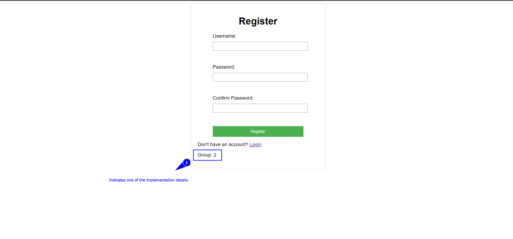

# Narwhal Authentication App

The Narwhal Authentication App offers a streamlined and secure approach to handling user authentication. Utilizing Flask for server-side operations, JavaScript for client-side dynamics, and SQLite3 for database management, this application ensures a seamless and secure user experience.

## Features

- Flask backend for robust server-side operations
- JavaScript-enhanced client-side for a responsive user experience
- SQLite3 database integration for efficient data management

## Getting Started

Follow these instructions to get a copy of the project up and running on your local machine for development and testing purposes.

### Prerequisites

- Python 3.6+
- pip (Python package installer)

### Installation

1. **Clone the Repository**
  ```
git clone https://github.com/AhmadHanif12/Narwal-Authentication
cd Narwal-Authentication
  ```

2. **Setup Virtual Environment (Optional)**
- Windows:
  ```
  python -m venv venv   # For windows a virtual envoirnment is already given in this repo. Skip only this line of code.
  .\venv\Scripts\activate
  ```
- macOS/Linux:
  ```
  python3 -m venv venv
  source venv/bin/activate
  ```

3. **Install Requirements**
  ```
pip install -r requirements.txt
  ```
### Database Setup

Initialize the SQLite3 database:
  ```
flask db upgrade

  ```

### Running the Application

1. **Set Environment Variables**
   - Development:
     ```
     export FLASK_APP=run.py
     export FLASK_ENV=development
     ```
     For Windows, use `set` instead of `export`.

2. **Start the Flask Server**
  ```
flask run
  ```
Visit `http://127.0.0.1:5000/` in your browser.

## Usage

- **Registration**: Users can register through the web interface.
- **Login**: Secure login functionality which shows displays the response regarding the authenticity of a user.

## Contributing

Contributions are welcome! Please feel free to contribute by submitting pull requests to improve the functionality, documentation, or feature set of this application.

## License

This project is licensed under the MIT License - see the LICENSE.md file for details.

## Acknowledgments

- Flask team for the comprehensive web framework.
- SQLite developers for the robust database engine.
- All contributors who have helped to improve this app.
- [Link to the helping material](references/NARWHAL.pdf)

## Demo 




